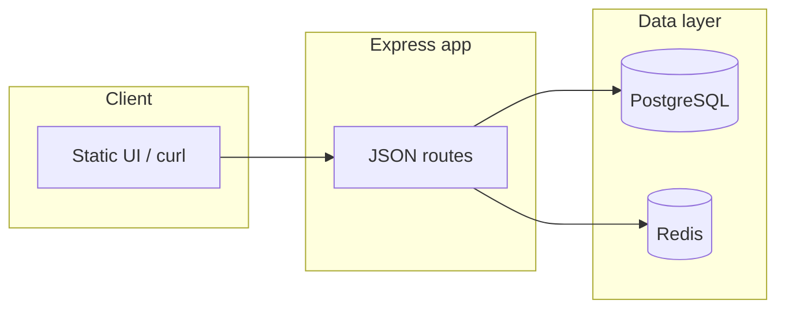

# Driver Matching System

Node.js and **Express** service that matches ride requests to nearby available drivers using **PostgreSQL** (source of truth) and **Redis** (GEO search + fast coordination). A small static UI in `public/` exercises the API from the browser.

> **Repository link:** This implementation is in your local workspace. To obtain a shareable GitHub URL, create a new repository on GitHub, then run `git remote add origin https://github.com/<you>/<repo>.git` and `git push -u origin main` (or your default branch). There is no hosted copy associated with this assistant.

---

## Setup instructions

### Prerequisites

- [Node.js](https://nodejs.org/) (LTS recommended)
- [Docker](https://docs.docker.com/get-docker/) (for Postgres + Redis)

### Steps

1. **Clone** the repository (after you have pushed it to GitHub, or work from this folder).

2. **Install dependencies**

   ```bash
   npm install
   ```

3. **Start databases**

   ```bash
   docker compose up -d postgres redis
   ```

4. **Configure environment** (optional)

   ```bash
   cp .env.example .env
   ```

   Defaults match `docker-compose.yml`: Postgres on host port `55432`, Redis on `6379`. Override `DATABASE_URL`, `REDIS_URL`, `PORT`, or `MATCH_RADIUS_KM` as needed.

5. **Apply schema**

   ```bash
   npm run db:sync
   ```

6. **Run the server**

   ```bash
   npm run start
   ```

   Open `http://localhost:3000` (or your `PORT`) for the UI and API on the same origin.

### Other commands

| Command        | Purpose                          |
| -------------- | -------------------------------- |
| `npm test`     | Jest unit tests (accept path)    |
| `npm run lint` | ESLint                           |
| `npm run build`| Syntax check (`node -c`)         |

---

## System design overview

### High-level architecture



### Responsibilities

| Component        | Role |
| ---------------- | ---- |
| **Express**      | HTTP API, JSON body parsing, request validation (`class-validator` / `class-transformer`), static files from `public/`, centralized error responses. |
| **PostgreSQL**   | Durable drivers, rides, per-ride driver offers, and in-app notification rows. Schema is created via `npm run db:sync` (`src/database/migrate.js`). |
| **Redis**        | `GEOADD` / `GEOSEARCH` for nearest available drivers; a set of available driver IDs; per-ride offer set and a short-lived assignment key used during accept. |

### Main flows

1. **Upsert driver** (`POST /drivers`): Writes/updates the driver row, then syncs Redis GEO + available set when status is `AVAILABLE`, or removes from GEO/available otherwise.

2. **Request ride** (`POST /rides`): In one DB transaction: inserts ride (`REQUESTED`), loads nearest candidates from Redis GEO (filtered by available set), enriches and caps at **three** drivers from Postgres, inserts `ride_driver_offers`, commits. After commit: caches offered driver IDs in Redis (`ride:offers:<rideId>`) and inserts notification rows.

3. **Accept ride** (`POST /rides/:rideId/accept`): Runs an **atomic Redis Lua script** first (see below), then a **Postgres transaction** that assigns the ride and updates offers/driver status. On DB failure after Redis accepted, the code attempts to roll back Redis assignment state.

### Key HTTP surface

- `GET /api` — service metadata and endpoint list  
- `GET /health` — liveness-style check  
- `POST /drivers`, `POST /rides`, `POST /rides/:rideId/accept` — documented under **API** in the original quick reference (curl examples still apply).

---

## Concurrency handling approach

Accepting a ride is the critical race: multiple offered drivers may accept at nearly the same time; exactly **one** must win.

### Layer 1 — Redis Lua script (atomic)

Script keys: `ride:offers:<rideId>`, `ride:assigned:<rideId>`, `drivers:available`. Argument: `driverId`.

The script, in order:

1. Rejects if the driver is **not** in the offer set (`NOT_OFFERED`).
2. Rejects if the driver is **not** still in the available set (`NOT_AVAILABLE`).
3. Attempts `SET ride:assigned:<rideId> <driverId> NX EX 3600`. Only the **first** successful `NX` wins; that caller gets `ACCEPTED` and the script removes the driver from `drivers:available`.
4. Later callers get `ALREADY_ASSIGNED`.

Lua runs atomically in Redis, so these checks and mutations are not interleaved with other clients.

### Layer 2 — Guarded SQL update (durable)

After Redis returns `ACCEPTED`, Postgres updates the ride only if it is still unassigned:

```sql
UPDATE rides
SET status = 'ASSIGNED', assigned_driver_id = $2, ...
WHERE id = $1 AND status = 'REQUESTED' AND assigned_driver_id IS NULL
```

If no row is updated, the service maps that to **not found** or **already assigned** depending on whether the ride exists. Offer rows and driver `BUSY` status are updated in the same transaction.

### Compensating action

If the DB transaction **fails after** Redis has recorded a winner, the service deletes `ride:assigned:<rideId>` and adds the driver back to `drivers:available` so the system does not leave Redis and Postgres permanently inconsistent without a retry path.

### Tests

`npm test` covers the accept path: not offered, late accept after assignment, and that the guarded `UPDATE` is used when Redis accepts.

---

## Assumptions and trade-offs

### Assumptions

- **Redis GEO + available set** stay consistent with Postgres for driver location/availability when all writes go through this API’s upsert path.
- **Offered drivers** are exactly those written to `ride:offers:<rideId>` in Redis after a successful ride request; accept validity is tied to that set (TTL 300s on the offer key).
- **`riderId`** is a string (not necessarily a UUID); drivers use UUIDs.
- **Match radius** and **candidate cap** (top 3 after DB enrichment) are acceptable product limits; configurable via `MATCH_RADIUS_KM` and fixed logic in code.

### Trade-offs

| Choice | Benefit | Cost |
| ------ | ------- | ---- |
| Redis-first accept gate | Very fast mutual exclusion across instances; single atomic decision | Extra moving parts; must compensate if DB fails after Redis |
| Postgres as source of truth | Auditable rides, offers, notifications; familiar querying | Higher latency than a Redis-only design |
| Top 3 offers only | Bounded notification fan-out and DB writes | A nearer driver outside the top 3 after filtering is never offered |
| `SET NX` assignment key with TTL | Prevents stale keys living forever | If TTL expires before DB completes, edge cases could theoretically diverge (mitigated by prompt commit) |
| No auth on API | Simple local demo and assignment | Not suitable as a public endpoint without tokens and rate limits |

### Not in scope (by design)

- Real push notifications (only `driver_notifications` rows with `IN_APP` channel).
- Surge pricing, routing, or driver/rider mobile apps.
- Horizontal scaling nuances (Postgres migrations, Redis cluster, idempotency keys) beyond what Redis `NX` + guarded SQL provide.

---

## API quick reference

Create or update a driver:

```bash
curl -X POST http://localhost:3000/drivers \
  -H "Content-Type: application/json" \
  -d '{"name":"Asha","latitude":28.6139,"longitude":77.2090,"status":"AVAILABLE"}'
```

Request a ride:

```bash
curl -X POST http://localhost:3000/rides \
  -H "Content-Type: application/json" \
  -d '{"riderId":"rider-1","pickupLatitude":28.6140,"pickupLongitude":77.2100}'
```

Accept a ride:

```bash
curl -X POST http://localhost:3000/rides/<ride-id>/accept \
  -H "Content-Type: application/json" \
  -d '{"driverId":"<driver-id>"}'
```
